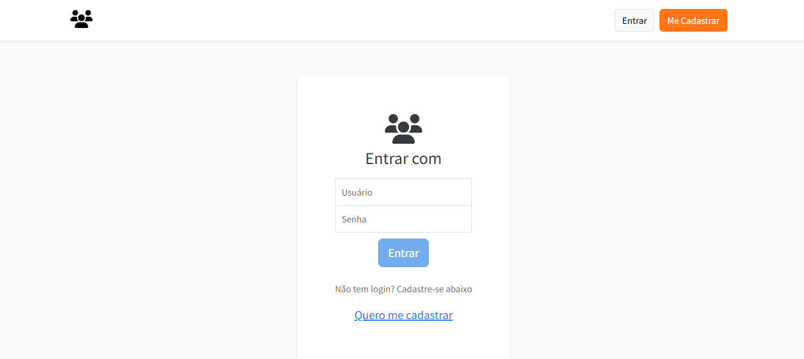
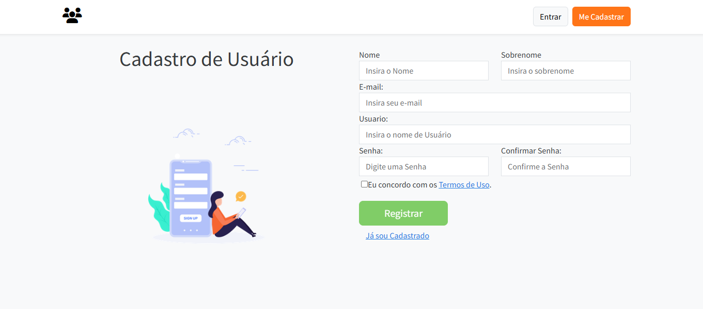
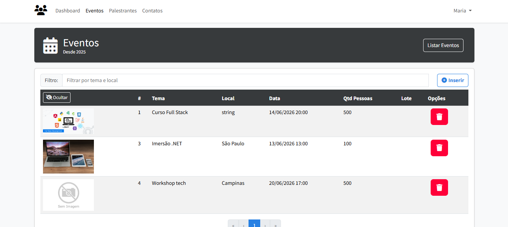
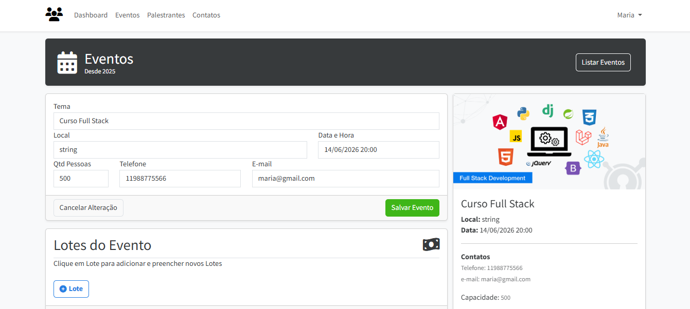
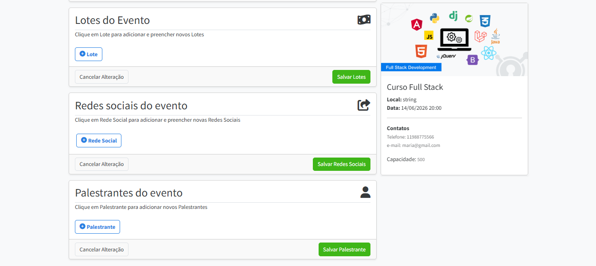

# ProEventos

Sistema web para gerenciamento de eventos desenvolvido com **Angular** e **.NET Web API**, permitindo o cadastro, consulta e gerenciamento de eventos, palestrantes e participantes.

## 🚀 Tecnologias Utilizadas

### Front-end

* Angular
* TypeScript
* Bootstrap
* RxJS

### Back-end

* ASP.NET Core Web API
* Entity Framework Core
* SQL Server
* AutoMapper

### Autenticação

* JWT (JSON Web Token)

---

## 📋 Funcionalidades

* Autenticação de usuários
* Cadastro e gerenciamento de eventos
* Cadastro de palestrantes
* Upload de imagens para eventos
* Consulta e pesquisa de eventos
* Gerenciamento de participantes
* Controle de acesso através de autenticação JWT
* Interface responsiva

---

## 📸 Screenshots

### Tela de Login



### Cadastro de usuário



### Listagem de Eventos



### Cadastro/Edição de Evento



### Detalhes do Evento



---

## ⚙️ Como Executar o Projeto

### Pré-requisitos

* Node.js
* Angular CLI
* .NET SDK
* SQL Server

### Configuração

Antes de executar o projeto, configure os User Secrets:

```bash
dotnet user-secrets set "TokenKey" "SuaChaveJWT"
dotnet user-secrets set "ConnectionStrings:Default" "SuaConnectionString"
```

### Front-end

```bash
npm install
ng serve
```

A aplicação estará disponível em:

```text
http://localhost:4200
```

### Back-end

```bash
dotnet restore
dotnet run
```

---

## 📁 Estrutura do Projeto

```text
src/
 ├── app/
 │   ├── components
 │   ├── services
 │   ├── models
 │   ├── guards
 │   └── interceptors
 ├── assets
 └── environments
```

---

## 🎯 Objetivo do Projeto

Este projeto foi desenvolvido com foco em aprendizado e aplicação prática de conceitos modernos de desenvolvimento web, incluindo:

* Arquitetura SPA com Angular
* Consumo de APIs REST
* Autenticação e autorização com JWT
* Boas práticas de desenvolvimento
* Integração entre front-end e back-end
* Persistência de dados com Entity Framework Core

---

## 📚 Créditos

Este projeto foi baseado no curso desenvolvido por Vinícius Andrade (VS Andrade).

- GitHub: https://github.com/vsandrade

Além do conteúdo original, foram realizadas customizações e melhorias próprias para fins de estudo e evolução técnica.

---

## 🔨 Melhorias Realizadas

Além da implementação original proposta no curso, o projeto recebeu evoluções com foco em boas práticas, segurança e manutenção do código.

### Tratamento Global de Exceções

* Implementação de middleware para tratamento centralizado de exceções.
* Padronização das respostas de erro da API.
* Redução da duplicação de código em controllers e serviços.
* Melhor experiência para o consumidor da API.

### Autenticação e Segurança

* Aperfeiçoamento do fluxo de autenticação utilizando JWT.
* Implementação de Refresh Tokens.
* Melhoria do processo de logout com invalidação segura de sessões.
* Renovação automática de tokens sem necessidade de novo login.

### Melhorias Gerais

* Refatorações para melhor organização do código.
* Atualização de dependências e pacotes.
* Ajustes de interface e experiência do usuário.

---

## 🚀 Próximas Melhorias

Funcionalidades planejadas para evolução contínua do projeto:

* Implementação de testes unitários
* Implementação de testes de integração
* Pipeline de CI/CD
* Containerização com Docker
* Aprimoramento da experiência do usuário (UX/UI)
* Documentação da API com Swagger mais detalhada

---

## 🎯 Conceitos Aplicados

- ASP.NET Core Web API
- Angular
- Entity Framework Core
- JWT Authentication
- Refresh Tokens
- Middleware para tratamento de exceções
- AutoMapper
- Repository Pattern
- Upload de arquivos
- API RESTful
- SQL Server
- Reactive Forms
- Guards e Interceptors

---

## 👨‍💻 Autor

Douglas Cabral

* GitHub: https://github.com/douglasscdoug
* LinkedIn: https://www.linkedin.com/in/douglas-cabral-531a49165/